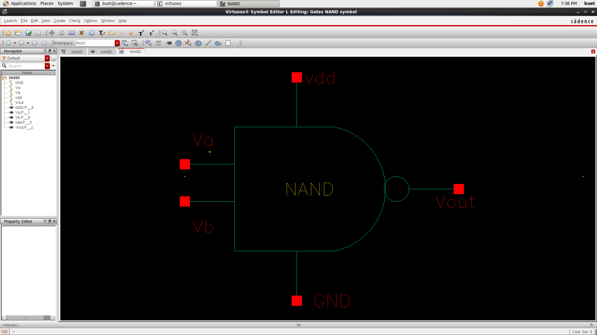
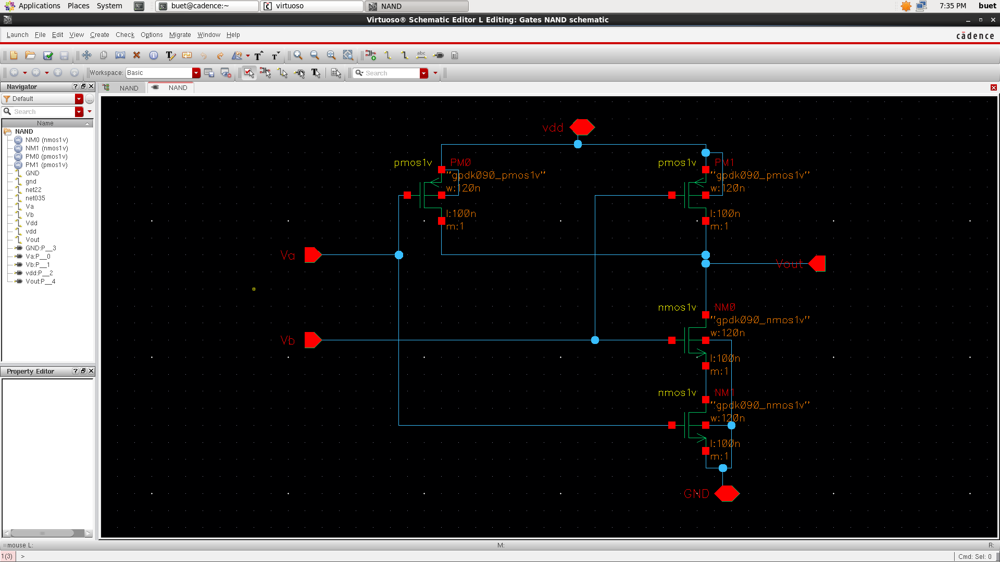
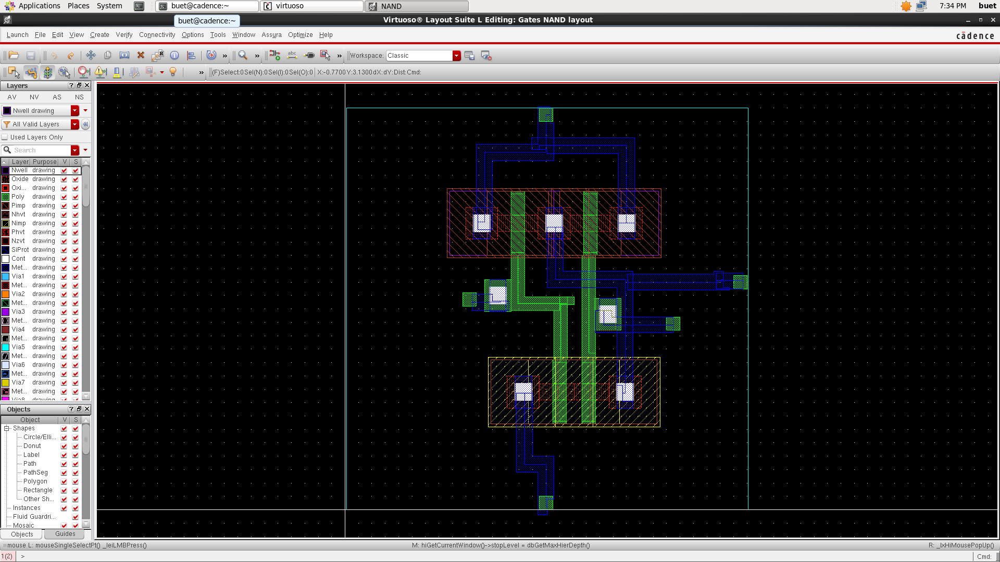

#  CMOS NAND Gate Design (Cadence Virtuoso)

##  Overview
This project demonstrates the design of a CMOS NAND gate using Cadence Virtuoso, including symbol creation, schematic design, and layout implementation.

---

##  Symbol

---

##  Schematic

---

##  Layout

---

##  Design Details
- PMOS transistors are connected in parallel
- NMOS transistors are connected in series
- Technology used: gpdk090

---

##  Logic Function
Output is LOW only when both inputs are HIGH.

| A | B | Output |
|---|---|--------|
| 0 | 0 |   1    |
| 0 | 1 |   1    |
| 1 | 0 |   1    |
| 1 | 1 |   0    |
