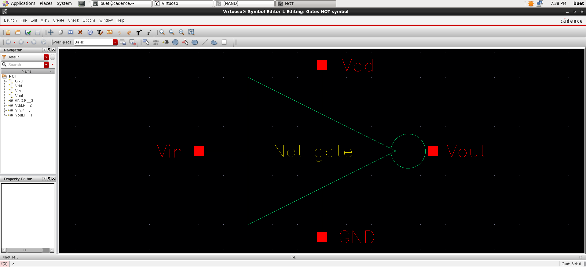
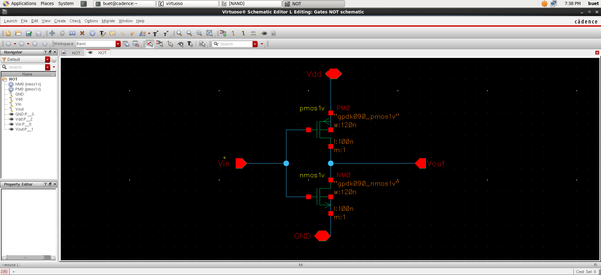
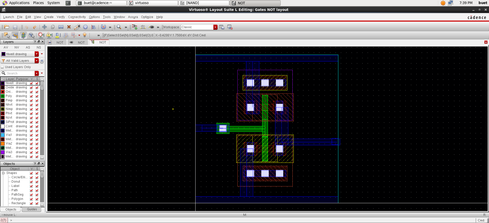

#  CMOS NOT Gate (Inverter) Design (Cadence Virtuoso)

##  Overview
This project demonstrates the design of a CMOS inverter (NOT gate) using Cadence Virtuoso, including symbol, schematic, and layout.

---

##  Symbol

---

##  Schematic

---

##  Layout

---

##  Design Details
- One PMOS transistor (pull-up network)
- One NMOS transistor (pull-down network)
- Technology used: gpdk090

---

##  Logic Function
The output is the inverse of the input.

| Input (A) | Output |
|-----------|--------|
|     0     |   1    |
|     1     |   0    |
